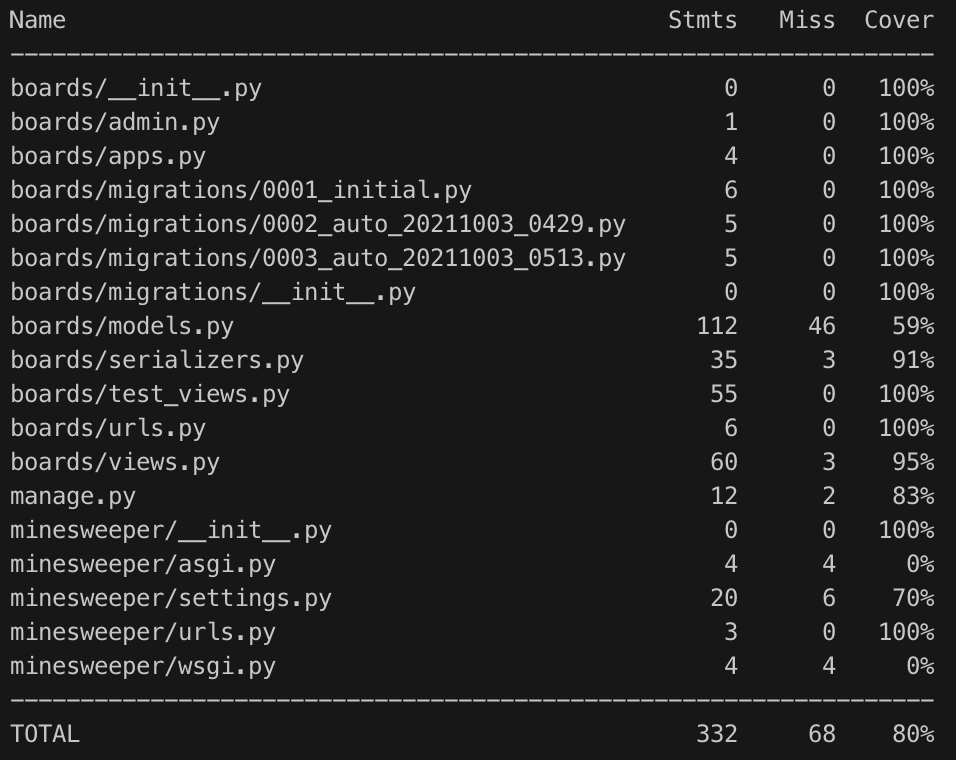

# minesweeper-challenge

This repository contains the client and the server required to run a Minesweeper game directly on the browser.

You can try the demo here:
http://165.22.181.229:3000/

## Setup the environments:

#

### Server:

After cloning, go to the `backend` folder and install the dependencies:

```
pip install -r requirements.txt
```

Apply the migrations:

```
python manage.py migrate
```

And run the server:

```
python manage.py runserver
```

To run all the tests and see the coverage report:

```
coverage run --source='.' manage.py test boards
coverage report
```

#

### Client:

Go to the `frontend` folder, install the dependencies and start the client:

```
yarn install
yarn start
```

To run all the tests and see the coverage report:

```
npm test -- --coverage
```

#

## Coverage:

### Backend



#

## Documentation:

APIs documentation can be found here:

http://165.22.181.229:8000/boards/

http://165.22.181.229:8000/boards/:id/

http://165.22.181.229:8000/boards/:id/flag/

http://165.22.181.229:8000/boards/:id/open/

http://165.22.181.229:8000/boards/:id/remake/
